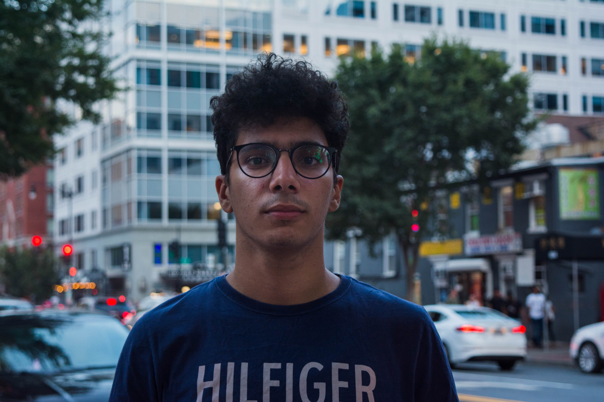
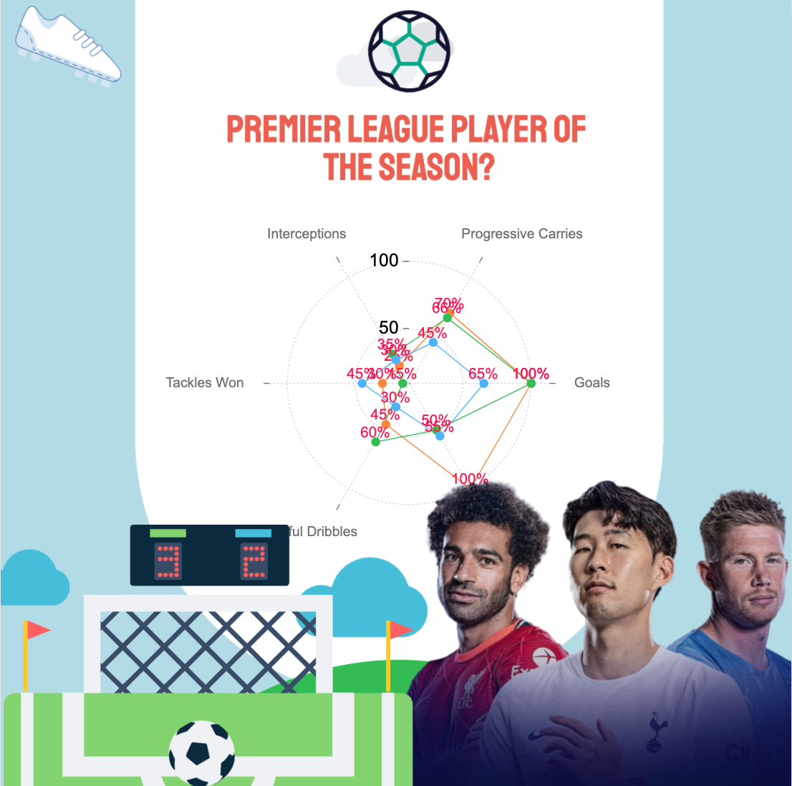

<style>


.distill-site-header{ 
  padding: 10px 0;
  font-size: 10px;
  letter-spacing: 2px;
  text-transform: uppercase;
  background-color: rgba(86, 109, 164, 0.85);
  box-shadow: 0px 2px 4px rgba(86, 109, 164, 0.7);
  color: black;
}
  
  /* Header */
  .header {
    align-items: center;
  }
  .header img {
    width: 80%;
    height: auto;
    border-radius: 0;
    border: none;
    margin-left: auto;
  }

  /* Main */
  main {
    margin: 2rem auto;
    max-width: 800px;
    text-align: left;
  }

  main h2, main p {
    text-align: left;
  }

  /* Contact */
  .contact {
    margin-top: 4rem;
    text-align: center;
  }
  .contact h2 {
    font-size: 1.5em;
    margin-bottom: 2rem;
  }
  .contact ul {
    list-style-type: none;
    margin: 0;
    padding: 0;
    display: flex;
    justify-content: center;
  }
  .contact ul li {
    margin: 0 1rem;
  }
  .contact ul li a {
    color: #555555;
    text-decoration: none;
    transition: color 0.2s;
  }
  .contact ul li a:hover {
    color: #007bff;
  }
  
  /* Icon */
  .icon {
    width: 25px;
    height: 25px;
    margin-right: 0.5rem;
  }

  /* Footer */
  footer {
    text-align: center;
    font-size: 0.8em;
    margin-top: 2rem;
  }

  /* Background */
  body {
    background: linear-gradient(to bottom, #608bbd, #acc2dc);
  }
</style>

<div class="header">
  
</div>

<main>

<h2>About Me</h2>

<p>I am a recent graduate of Bucknell University, where I earned a BS in Computer Science and Engineering. I am from Alexandria, Egypt. My favorite hobbies are watching/playing football and diving.</p>

</main>


### In the PL Visiualization section
<div class="header">
  
</div>

<div class="contact">
  <h2>Contact Me</h2>
  <ul>
    <li><a href="mailto:mohamed.bakr@bucknell.edu">Email</a></li>
    <li><a href="https://www.linkedin.com/in/mohamed-h-bakr/">LinkedIn</a></li>
    <li><a href="https://github.com/mohamedbakr-x">GitHub</a></li>
  </ul>
</div>

<footer>
  © 2023 Mohamed Bakr
</footer>

```{r, echo=FALSE, message=FALSE, warning=FALSE}
file.create(".nojekyll")
```

```{r setup, include=FALSE}
knitr::opts_chunk$set(echo = FALSE)

# Learn more about creating websites with Distill at:
# https://rstudio.github.io/distill/website.html

# Learn more about publishing to GitHub Pages at:
# https://rstudio.github.io/distill/publish_website.html#github-pages

```

