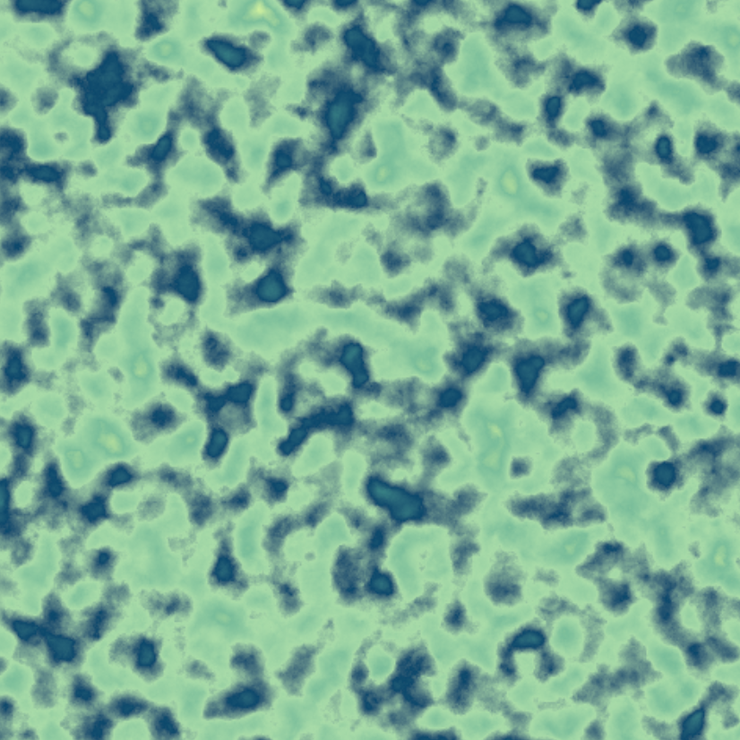
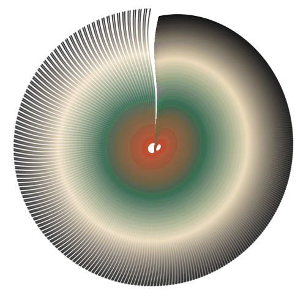
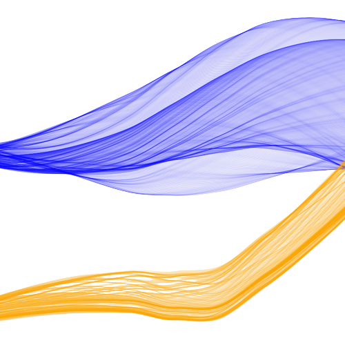

<style>

  .distill-site-header{ 
    padding: 10px 0;
    font-size: 10px;
    letter-spacing: 2px;
    text-transform: uppercase;
    background-color: rgba(86, 109, 164, 0.85);
    box-shadow: 0px 2px 4px rgba(86, 109, 164, 0.7);
    color: black;
  }
    
  
  /* Footer */
  footer {
    text-align: center;
    font-size: 0.8em;
    margin-top: 2rem;
  }
  
  /* Background */
  body {
    background: linear-gradient(to bottom, #608bbd, #acc2dc);
  }
  
  .image-grid {
    display: flex;
  }
  
  .image-grid img {
    width: 30%;
    height: auto;
    margin: 5px;
    
  .image-grid .image-description {
  text-align: center;
  width: 33.33%;
  margin: 0 auto;
  }

</style>

### Generative Art Project


<div class="image-description">
  <pre class="image-description">       Gemstone                      Function                  Bucknell Waves</pre>
</div>
<div class="image-grid">
  
  
  
</div>


### ggplot Extention project

```{r, echo=FALSE, message=FALSE, warning=FALSE}
library(ggplot2)
library(ggmosaic)
library(Lock5Data)
ggplot(data = NutritionStudy)+
  geom_mosaic(aes(x = product(VitaminUse, Smoke), fill = VitaminUse))+
  facet_grid(. ~Sex)+
  labs(y = "Vitamin Use",title = "Mosaic plot with Facetting")+
  theme(plot.title = element_text(hjust = 0.5)) +
  guides(fill=guide_legend(title="Vitamin Use")) +
  theme(axis.text.x = element_text(angle = 90, hjust = 1))+
  theme(plot.background = element_rect(fill = "#7d9ec9")) 
```
<p>This plot was from one of our projects. It is a mosaic plot with faceting, showing the relationship between vitamin usage, smoking status, and sex in a Nutrition Study database. The individual panels  allow for the comparison of these relationships between males and females. The colors in the plot represent different levels of vitamin usage. </p>


```{r, echo=FALSE, message=FALSE, warning=FALSE}
library(Lock5Data)
library(hexbin)
library(Hmisc)
library(ggplot2)
library(MASS)
data(survey)
data(StudentSurvey)
StudentSurvey = StudentSurvey[complete.cases(StudentSurvey), ]
StudentSurvey$Year = factor(StudentSurvey$Year, levels = c("FirstYear", "Sophomore", "Junior", "Senior"), ordered = TRUE)
attach(StudentSurvey)


survey.sub = survey[complete.cases(survey), ]
ggplot(survey.sub, aes(x = Smoke, y = Height, fill = Smoke)) + 
  geom_violin(scale = "width", alpha = 0.5) +
  scale_fill_discrete(name="Smoking Frequency") + 
  geom_boxplot(width = 0.25) + 
  labs(title = "Violin graph and Boxplot of height split by smoking frequency",x="Smoking Frequency", y = "Student Height") +
    theme(plot.background = element_rect(fill = "#8dabcf"))
```
<p> This plot combines violin plots and boxplots to visualize the distribution of student heights across different smoking frequencies from the "StudentSurvey" dataset. The violins provide an overview of the density and distribution of heights, while the boxplots display the quartiles, median, and potential outliers within each smoking frequency category. </p>

```{r, echo=FALSE, message=FALSE, warning=FALSE}
ggplot(StudentSurvey, aes(MathSAT, VerbalSAT)) + 
  stat_density_2d(aes(fill = ..level..), geom = "polygon", color = "grey", h = c(50, 50)) + 
  scale_fill_distiller(palette = "Spectral") +
  theme(plot.background = element_rect(fill = "#9fb8d7")) +
   labs(title = "Density plot (HeatMap) MathSAT vs VerbalSAT")
```
<p>This plot is a 2D density plot representing the distribution of data points based on the "MathSAT" and "VerbalSAT" variables from the "StudentSurvey" dataset. The density is visualized using polygons, where the fill color represents the density level. The density is more reddish in areas with higher density.</p>

### Shiny app project
```{r, echo=FALSE, message=FALSE, warning=FALSE}
library(shiny)
shinyApp(

 # Define UI 
ui <- fluidPage(
  titlePanel("Confidence Interval App"),
  
  sidebarLayout(
    sidebarPanel(
      selectInput("confidence", 
                  label = "Choose confidence level",
                  choices = c("85%", "90%", "95%", "99%"))
    ),
    
    mainPanel(
      plotOutput("interval_plot")
    )
  )
),

  server = function(input, output) {
 
 # Generate a set of 1000 random integers with a mean of 20
  random_integers <- round(rnorm(1000, mean = 10, sd = 5))
  
  # Function to compute confidence interval
  compute_ci <- function(confidence_level) {
    CI_list <- vector("list", 100)
    green_count <- 0
    red_count <- 0
    
    # Loop to sample the population, find the sample mean and the confidence interval
    for (i in 1:100) {
      sample <- sample(random_integers, size = 100, replace = TRUE)
      sample_mean <- mean(sample)
      sample_sd <- sd(sample)/sqrt(100)
      z_value <- qnorm((1 + as.numeric(sub("%", "", confidence_level))/100)/2)
      lower <- sample_mean - z_value*sample_sd
      upper <- sample_mean + z_value*sample_sd
      CI_list[[i]] <- c(lower, upper)
      
      if (lower <= 10 & upper >= 10) {
        green_count <- green_count + 1
      } else {
        red_count <- red_count + 1
      }
    }
    
    # Create a data frame
    CI_df <- data.frame(ci = 1:100, lower = sapply(CI_list, "[[", 1), upper = sapply(CI_list, "[[", 2))
    CI_df$mean <- rep(10, 100)
    CI_df$color <- ifelse(CI_df$lower <= 10 & CI_df$upper >= 10, "red", "green")
    
    green_percent <- round(green_count / 100 * 100)
    red_percent <- round(red_count / 100 * 100)
    
    CI_df$legend <- paste0(green_percent, "% Green")
    
    CI_df
  }
  
  # Render plot
  output$interval_plot <- renderPlot({
    CI_df <- compute_ci(input$confidence)
    
    # Plot the confidence intervals
    ggplot(CI_df, aes(x = ci, y = mean)) +
      geom_segment(aes(x = lower, y = ci, xend = upper, yend = ci, color = color), size = 1) +
      geom_vline(xintercept = 10, linetype = "dashed", color = "blue", size = 1) +
      scale_y_continuous(breaks = NULL, limits = c(0.5, 100.5)) +
      labs(x = "Confidence Interval", y = "Sample Index") +
      ggtitle(paste0(input$confidence, " Confidence Intervals")) +
      theme(plot.caption = element_text(hjust = 0.5, margin = margin(t = 10))) +
      labs(caption = CI_df$legend)
  })
  },

  options = list(height = 500)
)
```


<footer>
  © 2023 Mohamed Bakr
</footer>
